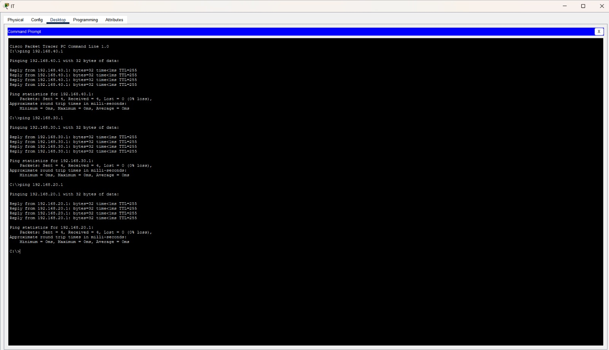

# Enterprise Campus Network Design and Implementation

Design and implement a secure, scalable enterprise Local Area Network (LAN) using VLANs, IEEE 802.1Q Trunking, Router-on-a-Stick, and Spanning Tree Protocol (STP). This project demonstrates enterprise network segmentation, inter-VLAN communication, and Layer 2 network stability using Cisco Packet Tracer.

---

# Project Overview

This project simulates an enterprise campus network consisting of four departments:

- Human Resources (HR)
- Finance
- Information Technology (IT)
- Sales

Each department is placed in its own VLAN to improve security and reduce broadcast traffic. Inter-VLAN communication is achieved using Router-on-a-Stick, while STP prevents Layer 2 switching loops.

---

# Objectives

- Design a scalable enterprise LAN
- Implement VLAN-based network segmentation
- Configure IEEE 802.1Q trunk links
- Configure Router-on-a-Stick for Inter-VLAN Routing
- Configure Spanning Tree Protocol (STP)
- Verify end-to-end connectivity
- Practice enterprise switch and router configuration

---

# Technologies Used

| Category | Technology |
|----------|------------|
| Network Simulator | Cisco Packet Tracer |
| Networking | TCP/IP, IPv4 |
| Layer 2 | VLAN, IEEE 802.1Q Trunking, STP |
| Routing | Router-on-a-Stick |
| Verification | Ping, Traceroute |

---

# Skills Covered

| Category | Skills |
|----------|--------|
| Networking Fundamentals | TCP/IP, OSI Model, IPv4, Subnetting |
| Enterprise Networking | LAN Design, Routing & Switching |
| Layer 2 Technologies | VLAN Configuration, IEEE 802.1Q Trunking, STP |
| Routing | Inter-VLAN Routing, Router-on-a-Stick |
| Device Configuration | Switch Configuration, Router Configuration |
| Network Verification | Ping, Traceroute |

---

# Software Requirements

| Software | Version |
|----------|---------|
| Cisco Packet Tracer | 8.x or later |

> **Note:** This project was created and tested using Cisco Packet Tracer.

---

# Repository Structure

```text
Enterprise-Campus-Network/
│
├── README.md
├── Enterprise-Campus-Network.pkt
│
└── screenshots/
    ├── Topology.jpeg
    ├── VLAN.jpeg
    ├── Ping.jpeg
    └── Tracert.jpeg
```

---

# Screenshots

## Network Topology

Enterprise campus network topology showing routers, switches, VLANs, and end devices.


---

## VLAN Configuration

Configured VLANs for HR, Finance, IT, and Sales departments with trunk links between switches.


---

## Ping Verification

Successful ICMP connectivity test verifying communication between different VLANs.



---

## Traceroute Verification

Traceroute confirming the routing path through the Router-on-a-Stick configuration.


---

# Verification

The following tasks were successfully completed:

- VLAN creation and configuration
- IEEE 802.1Q trunk configuration
- Router-on-a-Stick configuration
- Inter-VLAN communication
- STP operation
- End-to-end network connectivity
- Successful Ping verification
- Successful Traceroute verification

---

# 📈 Result

Successfully designed and implemented a secure and scalable enterprise campus network with VLAN segmentation and Inter-VLAN Routing.

The network enables secure communication between departments while maintaining efficient traffic management and reducing unnecessary broadcast traffic.

---

# Key Learning Outcomes

- Enterprise LAN Design
- VLAN Planning and Configuration
- IEEE 802.1Q Trunking
- Router-on-a-Stick
- Inter-VLAN Routing
- IPv4 Addressing
- Subnetting
- Spanning Tree Protocol (STP)
- Switch Configuration
- Router Configuration
- Network Testing
- Ping & Traceroute
- Enterprise Network Documentation

---

# Project Files

-  Project Documentation (`README.md`)
-  Cisco Packet Tracer Lab (`Enterprise-Campus-Network.pkt`)
-  Network Screenshots
-  Connectivity Verification

---

## Author

**Rajkumar S**

Aspiring **Network Engineer** passionate about:

- Enterprise Networking
- Routing & Switching
- Network Security
- Linux Administration
- Network Automation
- Cloud Networking

---

⭐ If you found this project useful, consider giving the repository a **Star**.
