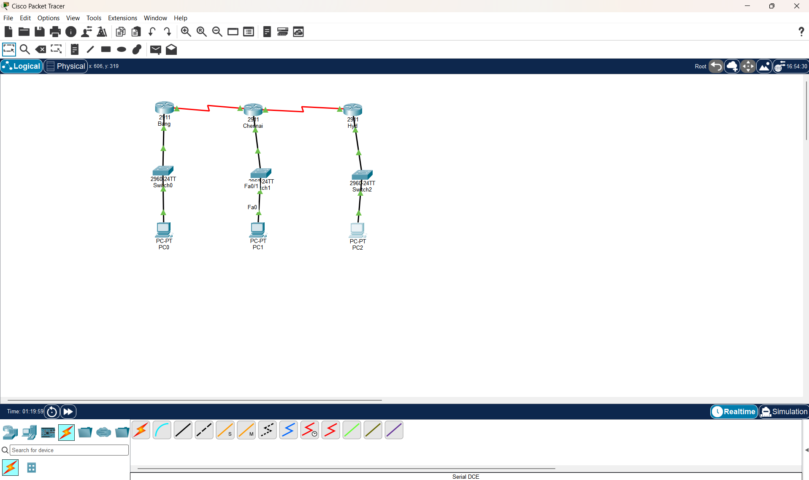
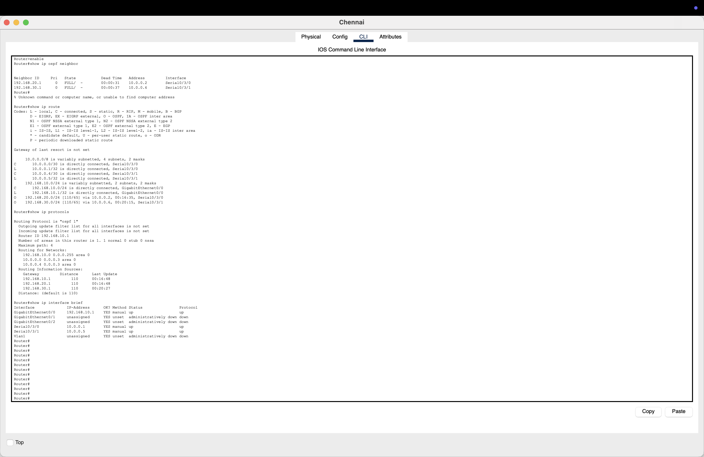
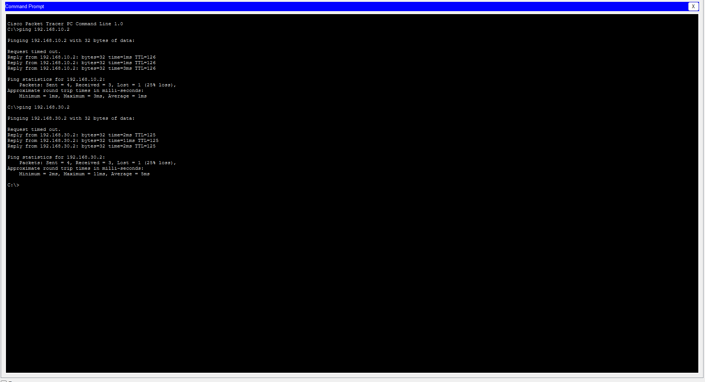
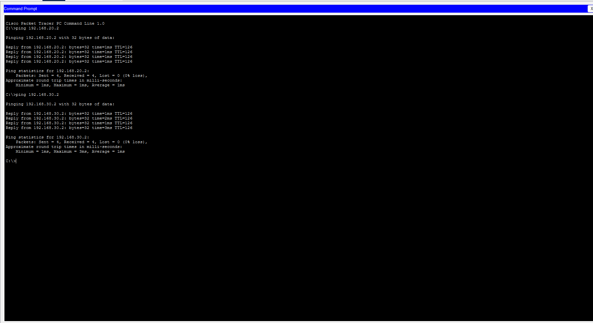
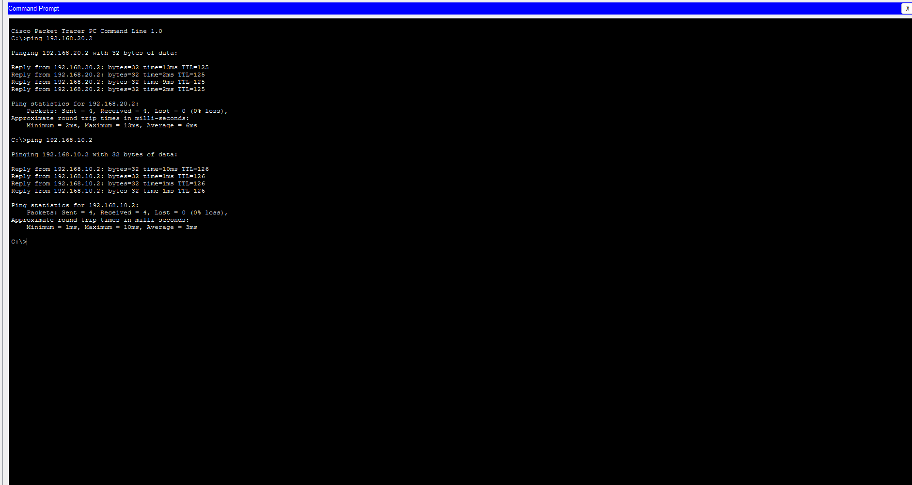

# Multi-Branch WAN Connectivity Using OSPF

## 📖 Overview

This project demonstrates the design and implementation of a **Multi-Branch Enterprise Wide Area Network (WAN)** using **OSPF (Open Shortest Path First)** dynamic routing protocol in **Cisco Packet Tracer**.

The network connects three geographically separated branch offices:

- 🏢 Bangalore
- 🏢 Chennai
- 🏢 Hyderabad

Each branch contains its own Local Area Network (LAN) connected through a Layer 2 switch. The branch routers are interconnected using **Serial DCE/DTE point-to-point links**, simulating dedicated WAN circuits provided by an Internet Service Provider (ISP).

Using **OSPF Area 0**, all routers automatically exchange routing information, enabling seamless communication between every branch network.

---

# 🎯 Objectives

- Design a scalable enterprise WAN
- Configure OSPF dynamic routing
- Connect multiple branch offices
- Simulate WAN communication using Serial DCE/DTE links
- Verify end-to-end connectivity
- Demonstrate enterprise routing concepts

---

# 🌐 WAN Architecture

This project simulates a real-world enterprise WAN where branch offices communicate through dedicated WAN connections.

In production environments, organizations generally use technologies such as:

- MPLS VPN
- Metro Ethernet
- SD-WAN
- Leased Lines
- Dedicated Fiber Links

Cisco Packet Tracer does not simulate service-provider MPLS infrastructure. Therefore, this project uses **Serial DCE/DTE links** to represent WAN circuits while focusing on enterprise routing configuration.

---

# 🖥️ Network Topology

```
                    WAN

        Bangalore -------- Chennai
             \               /
              \             /
               \           /
                Hyderabad

Each Branch

PC(s)
   │
Switch
   │
Router
```

---

# 🛠️ Technologies Used

- Cisco Packet Tracer
- TCP/IP
- IPv4
- OSPF (Area 0)
- Routing & Switching
- Serial DCE/DTE
- Enterprise WAN Design

---

# 📂 Project Structure

```text
Multi-Branch-WAN-Connectivity-Using-OSPF/
│
├── README.md
├── Multi-Branch-WAN-Connectivity-Using-OSPF.pkt
│
└── screenshots/
    ├── Network-Topology.png
    ├── Router-Verification.png
    ├── Ping-Bangalore.png
    ├── Ping-Chennai.png
    └── Ping-Hyd.png
```

---

# 🚀 Features

- Multi-Branch Enterprise WAN
- OSPF Dynamic Routing
- OSPF Area 0 Configuration
- Router-to-Router Communication
- LAN-to-LAN Connectivity
- Dynamic Route Learning
- Automatic Route Exchange
- IPv4 Addressing
- Serial Point-to-Point WAN Links
- Enterprise WAN Simulation
- End-to-End Connectivity

---

# 📸 Screenshots

## Network Topology

Complete enterprise WAN topology connecting Bangalore, Chennai, and Hyderabad.



---

## Router Verification

Verification includes:

- OSPF Neighbor Status
- Routing Table
- OSPF Protocol Information
- Interface Status



---

## Ping Test – Bangalore

Successful end-to-end communication from Bangalore.



---

## Ping Test – Chennai

Successful end-to-end communication from Chennai.



---

## Ping Test – Hyderabad

Successful end-to-end communication from Hyderabad.



---

# ✅ Verification

The following tests were performed successfully:

- OSPF Neighbor Verification
- Routing Table Verification
- Interface Status Verification
- OSPF Protocol Verification
- End-to-End Ping Testing
- Inter-Branch Connectivity Testing

---

# 💻 Verification Commands

```bash
show ip interface brief

show ip ospf neighbor

show ip route

show ip protocols

show running-config
```

---

# 📚 Skills Demonstrated

- Enterprise WAN Design
- Router Configuration
- Switch Configuration
- OSPF Configuration
- Dynamic Routing
- IPv4 Addressing
- Serial Interface Configuration
- Routing Table Analysis
- Network Troubleshooting
- TCP/IP Networking
- End-to-End Connectivity Testing

---

# 📈 Learning Outcomes

Through this project, I gained hands-on experience in:

- Designing enterprise WAN topologies
- Configuring OSPF Area 0
- Establishing OSPF neighbor relationships
- Configuring Serial WAN interfaces
- Troubleshooting routing issues
- Verifying network connectivity
- Understanding dynamic route exchange

---

# 🔮 Future Enhancements

- Multi-Area OSPF
- OSPF Authentication
- Route Summarization
- Default Route Advertisement
- Redundant WAN Links
- HSRP / VRRP
- NAT
- DHCP
- Access Control Lists (ACL)
- IPv6 Support
- QoS Configuration
- SD-WAN Integration

---

# 🖥️ Software Requirements

- Cisco Packet Tracer 9.x
- Compatible with Cisco Packet Tracer 8.x or later

---

# 📊 Result

Successfully designed and implemented a scalable **Multi-Branch Enterprise WAN** connecting **Bangalore**, **Chennai**, and **Hyderabad** using **OSPF Area 0**.

All routers established stable OSPF neighbor adjacencies and dynamically exchanged routing information over simulated WAN links. End-to-end connectivity between all branch LANs was successfully verified using routing table inspection, OSPF neighbor verification, interface status checks, and ICMP ping testing.

This project demonstrates practical enterprise networking concepts including WAN design, dynamic routing, router configuration, network troubleshooting, and connectivity verification using Cisco Packet Tracer.

---

# 👨‍💻 Author

**Yuvasrii**

If you found this project useful, consider giving it a ⭐ on GitHub.
